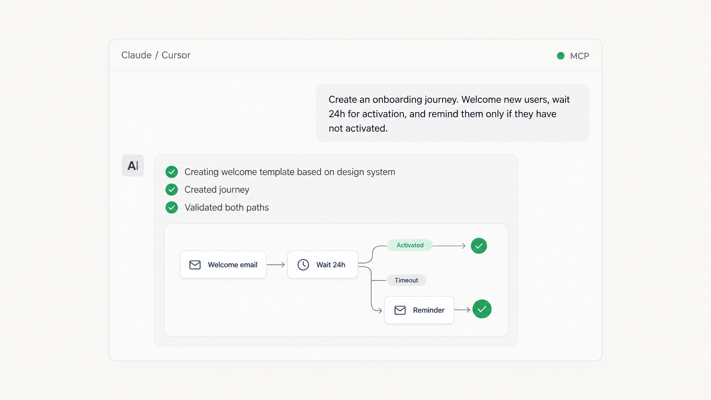
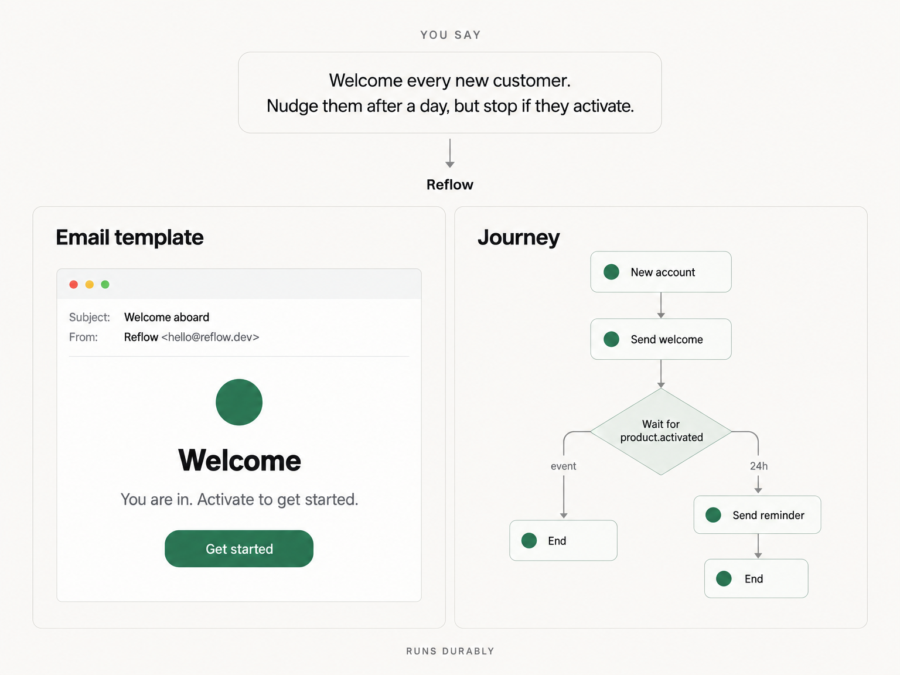
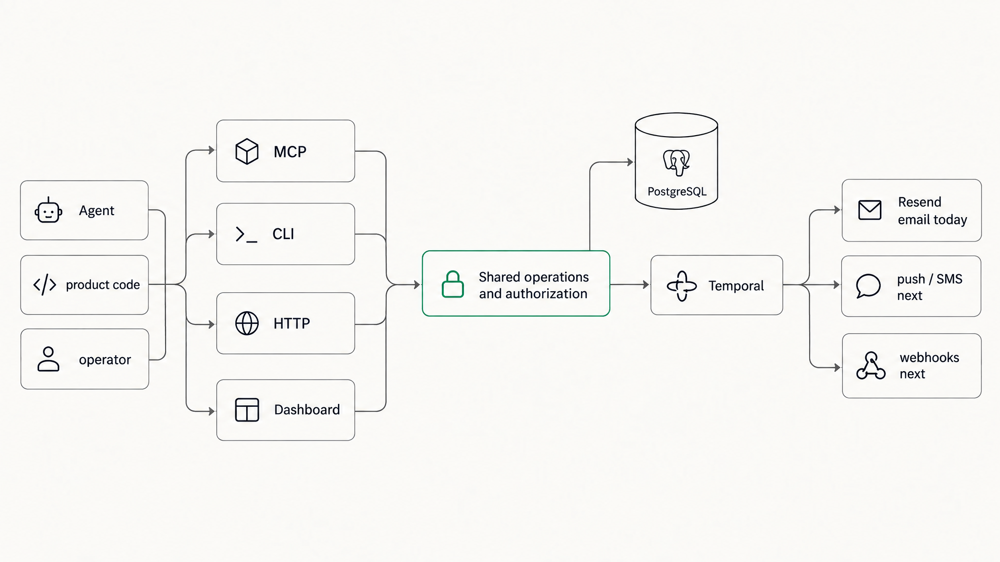

<!-- BEAUTIFIED -->
<p align="center">
  
</p>

<h1 align="center">Build customer journeys by asking.</h1>

<p align="center">
  <strong>Reflow is the open-source journey engine for AI agents.</strong>
  <br />
  <em>Describe what should happen. Your agent builds the workflow, tests every path, and Reflow runs it reliably for days, weeks, or months.</em>
</p>

<p align="center">
  <a href="#quick-start"></a>
</p>

<p align="center">
  <a href="docs/AUTHENTICATION.md">MCP native</a> ·
  <a href="docs/ARCHITECTURE.md">Powered by Temporal</a> ·
  <a href="docs/DEPLOYMENT.md">Self-hostable</a>
</p>

<p align="center">
  <a href="https://github.com/socialrobot-io/reflow/actions/workflows/sanity.yml"></a>
  <a href="https://www.npmjs.com/package/@socialrobot-io/reflow"></a>
  <a href="https://www.npmjs.com/package/@socialrobot-io/reflow"></a>
  <a href="package.json"></a>
  <a href="LICENSE"></a>
</p>



<p align="center">
  <sub>Your agent authors and validates. You decide what goes live.</sub>
</p>

## From prompt to production

Tell your agent what should happen. Reflow handles the rest.

No drag-and-drop builder. No translating product logic into a maze of automation blocks.

Your agent can inspect your existing templates and workflows, build the journey, validate its graph, simulate every branch, and show you exactly what will happen before anything goes live.



| Agent authored | Built to keep running | You stay in control |
| --- | --- | --- |
| Create and modify journeys through MCP or the CLI. | Wait for hours or weeks. Survive deploys and restarts. Resume at exactly the right step. | Review journeys, inspect live enrollments and messages, and decide what gets published. |

## Quick Start

### Prerequisites

- Node.js 22 or newer
- pnpm 11+ and Docker Compose (local server only)

### 1. Install the CLI

```sh
npm install --global @socialrobot-io/reflow
reflow --version
```

The CLI connects to a Reflow server; it does not install the server.

### 2. Start the server

```sh
git clone https://github.com/socialrobot-io/reflow.git
cd reflow
pnpm install
pnpm dev
```

`pnpm dev` starts PostgreSQL and Temporal, applies migrations, creates the initial administrator when needed, and runs the API, worker, dispatcher, and dashboard. Open [http://localhost:5173](http://localhost:5173) and, on a fresh database, sign in as `admin@localhost` with the generated password stored in `.reflow/dev-admin-password`.

Stop the application with `Ctrl+C`; stop its Docker services with `pnpm dev:infra:down`.

### 3. Log in with the CLI

```sh
reflow auth login --url http://localhost:3000
reflow call auth.whoami
```

The CLI completes OAuth Authorization Code with PKCE through the dashboard and stores short-lived access and rotating refresh credentials in a protected local file, never your password or browser cookie.

### 4. Connect an MCP client

Copy the checked-in [`examples/mcp/cursor.json`](examples/mcp/cursor.json) to `.cursor/mcp.json`:

```json
{
  "mcpServers": {
    "reflow": {
      "url": "http://localhost:3000/mcp"
    }
  }
}
```

Do not add a static `Authorization` header. Reflow publishes OAuth discovery metadata; compatible clients register with PKCE, show the requested scopes, and save their own grant. Operators can revoke the grant from **Connected apps**. For production, replace the URL with `https://your-reflow.example/mcp`. Redirect allowlists are described in [Authentication](docs/AUTHENTICATION.md).

## Usage

### Create the first journey with MCP

Give your MCP-capable agent this prompt:

> Create an activation welcome journey for new users: welcome them, give them 24 hours to activate, remind them once if they don't, and stop messaging them as soon as they activate.
>
> Hook it up to the app, reuse our existing setup and style, test it, and show me the result before anything goes live.

The agent can inspect, author, validate, and simulate, but must ask before publishing or enrolling a real contact. For the explicit CLI path with template files, graph JSON, publishing, and the 20-second event/timeout test, follow the [welcome + nudge tutorial](examples/welcome-nudge/).

### Send product events

```sh
reflow call event.emit --input '{
  "enrollmentId": "ENROLLMENT_ID",
  "eventId": "product-activation:ACTIVITY_ID",
  "eventType": "product.activated",
  "data": { "plan": "pro" }
}'
```

Keep `eventId` stable across retries. Production applications call the same `event.emit` operation over HTTP with a scoped machine credential, and MCP clients use `event_emit`. Complete CLI, HTTP, and MCP examples are in [Sending product events](docs/EVENTS.md).

### Trigger a journey from product code

```ts
import { ReflowSdk } from '@socialrobot-io/reflow-sdk';

const reflow = new ReflowSdk({
  url: process.env.REFLOW_URL,
  workspaceId: process.env.REFLOW_WORKSPACE_ID,
  apiKey: process.env.REFLOW_API_KEY, // user-bound key with the send scope
});

await reflow.trigger({
  workflowVersionId: 'WORKFLOW_VERSION_ID',
  contact: { email: 'user@example.com' },
  idempotencyKey: 'activation-welcome:user@example.com',
});
```

The SDK upserts the contact and starts an idempotent enrollment. Keep the API key server-side; browser bundles must call your own backend endpoint.

### Operate Reflow

```sh
reflow workflow show --name "Activation welcome"
reflow call enrollment.list
reflow call message.list
```

The operations console at [http://localhost:5173](http://localhost:5173) shows journey graphs, live enrollments, timelines, messages, OAuth consent, and connected apps.

## Architecture



| Concept | Meaning |
| --- | --- |
| Journey / workflow | A graph of actions, waits, branches, events, and end states |
| Workflow version | Immutable graph used by new enrollments |
| Template version | Immutable rendered content pinned by a send action |
| Enrollment | One durable run for one contact |
| Event | A named product fact that can resume a waiting enrollment |
| Action | A channel or data operation such as `email.send` or `contact.update` |

See [Architecture](docs/ARCHITECTURE.md) for the full design.

## Configuration

Server variables, documented in [`.env.example`](.env.example):

| Variable | Purpose |
| --- | --- |
| `REFLOW_DOMAIN`, `PUBLIC_URL` | Public hostname and URL of the deployment |
| `DATABASE_URL` | PostgreSQL connection string |
| `BETTER_AUTH_SECRET` | Auth signing secret, at least 32 random characters |
| `ALLOW_REGISTRATION` | Public registration, disabled by default |
| `TRUSTED_ORIGINS` | Origins allowed to call the API |
| `OAUTH_PUBLIC_REDIRECT_ORIGINS`, `OAUTH_PUBLIC_REDIRECT_SCHEMES` | Explicit callback allowlists for public MCP clients |
| `TEMPORAL_ADDRESS`, `TEMPORAL_NAMESPACE`, `TEMPORAL_TASK_QUEUE` | Temporal connection and task routing |
| `RESEND_API_KEY` / `RESEND_API_KEY_FILE`, `RESEND_WEBHOOK_SECRET` | Resend credential and signed delivery webhooks |
| `REFLOW_FROM` | Verified sender identity |
| `OAUTH_PROVIDER_ID`, `OAUTH_DISCOVERY_URL`, `OAUTH_CLIENT_ID`, `OAUTH_CLIENT_SECRET` | Optional human OAuth/OIDC provider |

CLI and SDK environments use `REFLOW_URL` plus `REFLOW_TOKEN` or `REFLOW_API_KEY`; the SDK also reads `REFLOW_WORKSPACE_ID`.

Validation and simulation work without Resend. Before a real enrollment can send email, create `secrets/resend_api_key` with mode `0600`, then add `RESEND_API_KEY_FILE=./secrets/resend_api_key` and `REFLOW_FROM` to `.env.local` and restart `pnpm dev`. Domain verification and safe test addresses are covered in [Resend setup](docs/RESEND.md).

## API

Every operation is defined once and exposed three ways: HTTP `POST /v1/operations/<operation>`, an MCP tool with dots converted to underscores, and the generic `reflow call` CLI command.

| Operations | Effect |
| --- | --- |
| `system.capabilities`, `auth.whoami`, `workspace.list` | Discover runtime, current access, and workspaces |
| `account.create` | Deployment administrator creates an account and optional membership |
| `credential.create`, `credential.revoke` | User-bound machine API keys; secret-returning creation is HTTP/CLI only |
| `template.create`, `template.list`, `template.revise`, `template.publish`, `template.archive`, `template.render` | Manage, render, and publish HTML or plain templates |
| `workflow.actions` | List the installed action registry |
| `workflow.create`, `workflow.list`, `workflow.validate`, `workflow.simulate`, `workflow.publish` | Author, check, trace, and version capability graphs |
| `contact.upsert`, `contact.list` | Manage enrolled contacts |
| `enrollment.create`, `enrollment.list`, `enrollment.pause`, `enrollment.resume`, `enrollment.cancel` | Start, inspect, and control durable executions |
| `event.emit` | Durably accept a stable event ID; identical retries are no-ops |
| `message.list`, `webhook_event.list` | Inspect the send ledger and verified Resend events |

MCP also serves `reflow://operations`, `reflow://workflow/schema`, and `reflow://workflow/actions`, plus the `design-workflow` authoring prompt and the first-party agent skill. The full contract is in [Operations and MCP contract](docs/OPERATIONS.md).

## Project Structure

```text
apps/
├── dashboard/        # React operations console and OAuth UI
└── server/           # Hono API, Better Auth, Temporal workers, Resend adapter
packages/
├── contracts/        # Shared operation and journey schemas
├── cli/              # @socialrobot-io/reflow CLI
├── sdk/              # @socialrobot-io/reflow-sdk for server actions and UI backends
└── mcp-ext-skills/   # MCP skills extension shim
docs/                 # Architecture, authentication, deployment, operations, events guides
examples/             # welcome-nudge tutorial and MCP client configs
migrations/           # PostgreSQL migrations
scripts/              # Dev orchestration, deployment, workflow bundling
skills/               # First-party agent skill
tests/                # Repository validation suite
```

## Tech Stack

| Layer | Technology |
| --- | --- |
| Runtime | Node.js 22+, TypeScript 5.9, pnpm 11 |
| API | Hono, Better Auth (OAuth provider, API keys), MCP SDK |
| Orchestration | Temporal durable workflows with replay checks |
| Data | PostgreSQL, Drizzle ORM |
| Email | React Email, Resend |
| Dashboard | React 19, Vite |
| Workspace | Nx 23, Docker Compose, Caddy TLS |

## Deployment

Point a hostname at a Linux server with Docker and ports 80/443 available, then run:

```sh
./scripts/deploy.sh reflow.example.com admin@example.com
```

The script generates deployment secrets, builds the stack, configures Caddy TLS, runs migrations, and performs idempotent admin setup. See [Deployment](docs/DEPLOYMENT.md) for Coolify, external ingress, backups, and production topology.

CI runs the same `make check` gate on every push and pull request.

## Contributing

Contributions follow the standard fork, branch, commit, pull request workflow. Before opening a PR, run the complete release gate:

```sh
make check
```

It runs repository validation, linting, typechecks, backend and dashboard tests, Temporal replay checks, all builds, Compose validation, and an npm package dry run. Read [CONTRIBUTING.md](CONTRIBUTING.md) for the full rules, and update the docs and [agent skill](skills/reflow/SKILL.md) when behavior changes. The CLI release process is documented in [Releasing](docs/RELEASING.md).

Reflow is early. If you try it, open an issue and tell us where setup hurt, which journey actions you need next, and whether the MCP flow felt natural.

## License

Reflow is licensed under the [GNU Affero General Public License v3.0](LICENSE) only (`AGPL-3.0-only`).
